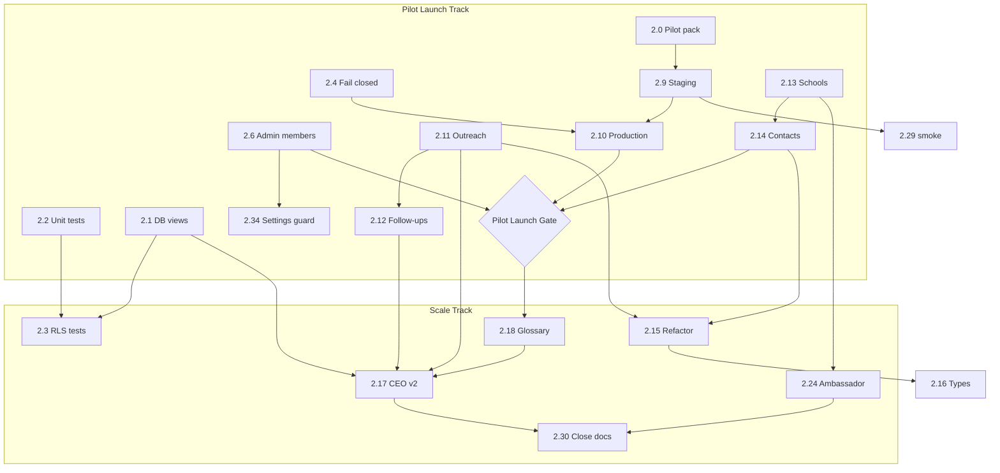

# Phase 2 Roadmap — Architectural Review

**Reviewers:** Principal Software Architect, CTO  
**Document reviewed:** `docs/phase-2-roadmap.md`  
**Date:** July 3, 2026  
**Status:** Recommendations only — no application code changes

---

## Review summary

The Phase 2 roadmap is **directionally sound**: security closure before scale, CRM depth before growth features, and independently shippable tasks mirror Phase 1 discipline. However, the published order has **dependency conflicts**, **pilot gates that are too heavy**, and **missing operational tasks** that university partners will ask for on day one.

**Verdict:** Approve the roadmap with the adjustments in this document. Split Phase 2 into two delivery horizons:

1. **Pilot Launch Track (PLT)** — minimum for hosted pilot universities (~4–6 weeks, one engineer)  
2. **Scale Track (ST)** — post-first-pilot hardening and growth (~6–8 additional weeks)

---

## 1. Is the implementation order correct?

### What is correct

| Aspect | Assessment |
| --- | --- |
| Security & platform before CRM scale | Correct — 2.1–2.6 belong early |
| Staging (2.9) before production (2.10) | Correct |
| CRM workflows before Ambassador | Correct — avoids P2-R3 |
| LLM (2.27) marked optional/gated | Correct — avoids P2-R4 |
| Unit tests (2.2) near security work | Correct |

### What should change

| Issue | Problem | Recommended fix |
| --- | --- | --- |
| **2.7 before 2.11–2.14** | Task 2.7 audits CRM mutations that do not exist until 2.11–2.14 | Split 2.7: add audit calls **inside each CRM task** (2.11–2.14); keep 2.7 as checklist/audit action enum only, or move 2.7 after 2.14 |
| **2.15–2.16 before CRM** | Refactor delays pilot value; new actions will touch `lib/supabase.ts` anyway | Move 2.15–2.16 **after** 2.14 or post-pilot; use narrow `lib/actions/*` files without full split first |
| **2.29 at end** | E2E smoke too late to protect first pilot deploy | Add **minimal smoke** after 2.9 (staging); keep full Playwright suite at 2.29 |
| **2.30 at end** | Pilot sign-off pack needed **before** first university, not after Phase 2 close | Extract pilot pack to **2.0 (PLT)** — early documentation task |
| **2.4 placement** | Fail-closed production should precede any hosted pilot URL | Move 2.4 immediately after 2.9 staging setup (before 2.10) |
| **Ambassador in exit criteria** | Roadmap exit criteria require Ambassador MVP; executive summary allows pilot without it | Remove Ambassador from **pilot gate**; keep in Phase 2 full exit criteria |

### Adjusted order (recommended)

See Section 8 below for the authoritative sequence.

---

## 2. Are any important tasks missing?

Yes. The roadmap references capabilities in Sections 6–13 that lack dedicated tasks.

| Gap | Why it matters | Proposed task |
| --- | --- | --- |
| **Pilot onboarding pack (early)** | Universities need MOU technical appendix, role matrix, env checklist before go-live | **2.0** Pilot IT & onboarding documentation |
| **README / doc hygiene** | Stale “routes not protected” text undermines IT review | **2.31** Documentation sync pass |
| **Error monitoring** | Deployment strategy mentions Sentry; no task | **2.32** Error monitoring integration (staging first) |
| **Membership invite flow** | DB section mentions `membership_invites`; 2.6 only manages existing members | **2.33** Email invite flow (optional PLT; SQL acceptable for first pilot) |
| **Settings route protection** | `/settings/*` must be admin-gated in middleware | **2.34** Middleware guards for settings routes |
| **Pilot security packet** | P2-R6: university IT will request one-pager | Include in **2.0** |
| **Incident response runbook** | Production deploy without IR plan is a gap | **2.35** Incident response runbook (with 2.10) |
| **Pagination** | Architecture audit flags unbounded lists; pilot data may grow | **2.36** Pagination for schools/contacts (ST, post-pilot) |
| **Bulk CSV import** | Listed in Section 7 CRM scope; no task | **2.37** Admin CSV import (ST, defer) |
| **npm audit allowlist expiry** | Phase 1 CI non-blocking audit needs governance | **2.38** Dependency audit allowlist with expiry (small; with 2.2) |

---

## 3. Are any tasks unnecessary?

Not unnecessary for Phase 2 **overall**, but several are **unnecessary before pilot universities** and should be demoted to Scale Track or Phase 3.

| Task | Verdict | Rationale |
| --- | --- | --- |
| **2.8** Rate limit retention | Defer post-pilot | Low row volume in pilot; no user-facing impact |
| **2.15** Full `lib/supabase.ts` split | Defer post-pilot | Large refactor with zero user value; do after CRM actions stabilize |
| **2.16** Generated DB types | Partial PLT | Add script early (small); full cast removal can follow refactor |
| **2.20** Weekly metric snapshots | Defer post-pilot | CEO v1 live counts suffice for first pilots |
| **2.21** Research sources normalization | Defer post-pilot | `profile_sources` array works for pilot |
| **2.22** Async research jobs | Defer until proven need | Only required if timeouts observed in pilot |
| **2.23** Research domain allowlist | Optional PLT | Phase 1 SSRF blocks are sufficient initially |
| **2.24–2.26** Ambassador platform | Defer post-pilot | Unless a specific pilot contract requires ambassadors |
| **2.27** Opt-in LLM | Defer Phase 3 or late ST | Legal review, provider contracts, data processing addendum |
| **2.28** CSV export | Defer post-pilot | Audit-worthy but not day-one pilot need |
| **2.19** Funnel conversion chart | Partial PLT | Nice for CEO; v1 dashboard acceptable for pilot launch |

**Nothing should be deleted** from the roadmap — only **re-tiered** by pilot vs scale timing.

---

## 4. Highest business value tasks

Ranked by impact on **pilot revenue, trust, and daily usage**.

| Rank | Task | Business value |
| --- | --- | --- |
| 1 | **2.9 + 2.10** Staging & production deploy | Unlocks hosted pilot; without this, no university can use the product |
| 2 | **2.6** Admin membership UI | Onboard university observers and sales in &lt;15 min vs SQL |
| 3 | **2.11–2.14** CRM workflows | Sales team logs real work; pilot proves CRM replaces spreadsheets |
| 4 | **2.1** DB read-only views | Closes #1 institutional trust gap from Phase 1 risk register |
| 5 | **2.0** Pilot onboarding pack | Accelerates legal/IT approval; reduces deal friction |
| 6 | **2.13** School create/update | Pipeline motion visible to executives and partners |
| 7 | **2.12** Follow-up management | Operational discipline; reduces dropped opportunities |
| 8 | **2.17 + 2.18** CEO dashboard v2 + glossary | Executive sponsorship; read-only university observers see progress |
| 9 | **2.4** Fail closed in production | Prevents embarrassing sample-data leak on public URL |
| 10 | **2.6 + 2.34** Settings protection | Admin surface secured |

---

## 5. Highest engineering risk tasks

| Rank | Task | Risk | Mitigation |
| --- | --- | --- | --- |
| 1 | **2.1** DB read-only views | Wrong view grants leak columns or break writers | Separate views; RLS matrix test before deploy |
| 2 | **2.22** Async research jobs | New job lifecycle, polling, failure modes | Defer until needed; start with DB job table only |
| 3 | **2.15** Monolith split | Wide diff; subtle regressions across dashboard/profile/actions | Defer; incremental `lib/actions/*` first |
| 4 | **2.24** Ambassador schema + role | New RLS surface, fourth user type, portal routes | Defer post-pilot unless contracted |
| 5 | **2.27** LLM provider | Data processing, prompt leakage, cost, legal | Feature flag off by default; legal gate |
| 6 | **2.10** Security headers / CSP | Misconfigured CSP breaks Next.js scripts | Staged rollout; report-only CSP first |
| 7 | **2.3** Automated RLS matrix | CI secrets, flaky remote Supabase dependency | Document manual matrix for PLT; automate in ST |
| 8 | **2.1 + 2.17** Metric query changes | Date filters + views can skew CEO numbers | 2.18 glossary + test fixtures |

---

## 6. Required before pilot universities

### Pilot Launch Gate (PLG) — must complete

| Task | PLG rationale |
| --- | --- |
| **2.0** | IT/security packet and onboarding checklist |
| **2.1** | DB-enforced read-only privacy (institutional due diligence) |
| **2.2** | Unit tests in CI (regression safety) |
| **2.4** | No sample data on production URL |
| **2.5** | MFA documentation for admin accounts |
| **2.6** | Admin can provision pilot users |
| **2.9** | Staging environment for rehearsal |
| **2.10** | Production hosting with HTTPS + headers |
| **2.31** | Accurate README for IT reviewers |
| **2.32** | Error monitoring on staging/production |
| **2.34** | Settings routes admin-gated |
| **2.35** | Incident response runbook |
| **2.11–2.14** | Minimum CRM: outreach, follow-ups, school + contact CRUD |

### Strongly recommended (first 2 weeks of pilot)

| Task | Rationale |
| --- | --- |
| **2.3** | RLS matrix (manual run acceptable if automation blocked) |
| **2.18** | Metric glossary (CEO alignment) |
| **2.29** | Minimal E2E smoke on staging |
| Audit in 2.11–2.14 | Incremental audit per mutation |

### Not required for pilot launch

2.8, 2.15, 2.19, 2.20, 2.21, 2.22, 2.23, 2.24–2.26, 2.27, 2.28, 2.16 (full), 2.17 (v2 — **v1 CEO dashboard is acceptable** for first pilot)

---

## 7. Can wait until after pilots

| Task group | When to schedule |
| --- | --- |
| **Ambassador (2.24–2.26)** | After first pilot proves CRM motion; or when contract requires |
| **Research v2 (2.21–2.23, 2.22)** | After pilot feedback on research timeouts/quality |
| **LLM (2.27)** | Phase 3 or post-pilot legal review |
| **Analytics depth (2.19, 2.20)** | After 30+ days of pilot data |
| **Export (2.28)** | When partner requests data portability |
| **Refactor (2.15, 2.16 full)** | After CRM actions stable (~pilot week 4+) |
| **CEO v2 (2.17)** | After glossary (2.18); v1 suffices at launch |
| **Rate limit retention (2.8)** | Before second pilot cohort or 10k+ rate limit rows |
| **Phase 2 close docs (2.30)** | End of full Phase 2, not first pilot |

---

## 8. Recommended implementation order

### Horizon A — Pilot Launch Track (weeks 1–6)

```
2.0  Pilot onboarding & IT security packet
2.2  Security unit tests + CI test step (+ 2.38 audit allowlist)
2.1  Database read-only views
2.31 Documentation sync (README, stale audits)
2.6  Admin membership management
2.34 Middleware guards for /settings/*
2.4  Fail closed without Supabase in production
2.5  MFA & session hardening docs
2.9  Staging deployment runbook
2.32 Error monitoring (staging)
2.29 Minimal E2E smoke (auth + login + dashboard)  ← early subset
2.11 Outreach logging (+ audit)
2.12 Follow-up management (+ audit)
2.13 School create/update (+ audit)
2.14 Contact create/update (+ audit)
2.35 Incident response runbook
2.10 Production deploy + security headers
2.32 Error monitoring (production)
─── PILOT LAUNCH GATE ───
```

### Horizon B — Scale Track (weeks 7–14)

```
2.3  RLS matrix tests (automated or documented)
2.18 Metric glossary
2.17 CEO dashboard v2
2.19 Funnel conversion analytics
2.16 Generated Supabase types (script + incremental adoption)
2.7  Audit coverage review / any gaps from PLT
2.28 CSV export with audit
2.29 Full E2E suite (redaction, roles)
2.8  Rate limit retention
2.20 Weekly metric snapshots
2.21 Research sources normalization
2.23 Research domain allowlist
2.22 Async research jobs (if pilot proved need)
2.15 lib/supabase.ts domain split
2.24–2.26 Ambassador platform (if product priority)
2.27 LLM assistive (legal gate — likely Phase 3)
2.33 Membership email invites
2.36 Pagination
2.37 Bulk CSV import
2.30 Phase 2 completion reports
```

---

## 9. Priority ranking

**P0 — Pilot blocking**

| Priority | Task | Effort |
| --- | --- | --- |
| P0 | 2.0 Pilot onboarding pack | Small |
| P0 | 2.9 Staging deploy | Medium |
| P0 | 2.4 Fail closed production | Small |
| P0 | 2.10 Production deploy | Medium |
| P0 | 2.6 Admin membership UI | Medium |
| P0 | 2.1 DB read-only views | Large |

**P1 — Pilot value & trust**

| Priority | Task | Effort |
| --- | --- | --- |
| P1 | 2.11 Outreach logging | Medium |
| P1 | 2.12 Follow-up management | Medium |
| P1 | 2.13 School CRUD | Medium |
| P1 | 2.14 Contact CRUD | Medium |
| P1 | 2.2 Unit tests + CI | Medium |
| P1 | 2.34 Settings middleware | Small |
| P1 | 2.31 Doc hygiene | Small |
| P1 | 2.35 Incident runbook | Small |

**P2 — Post-launch hardening (first 30 days of pilot)**

| Priority | Task | Effort |
| --- | --- | --- |
| P2 | 2.3 RLS matrix tests | Large |
| P2 | 2.18 Metric glossary | Small |
| P2 | 2.17 CEO dashboard v2 | Medium |
| P2 | 2.32 Error monitoring | Small |
| P2 | 2.29 Full E2E | Medium |
| P2 | 2.5 MFA docs | Small |

**P3 — Scale & growth**

| Priority | Task | Effort |
| --- | --- | --- |
| P3 | 2.19 Funnel analytics | Medium |
| P3 | 2.28 CSV export | Medium |
| P3 | 2.15 Domain refactor | Large |
| P3 | 2.16 Generated types | Medium |
| P3 | 2.24–2.26 Ambassador | Large (combined) |

**P4 — Defer / optional**

| Priority | Task | Effort |
| --- | --- | --- |
| P4 | 2.8 Rate limit retention | Small |
| P4 | 2.20 Metric snapshots | Medium |
| P4 | 2.21–2.23 Research v2 | Medium–Large |
| P4 | 2.22 Async research | Large |
| P4 | 2.27 LLM | Large |
| P4 | 2.33 Email invites | Medium |
| P4 | 2.36 Pagination | Medium |
| P4 | 2.37 Bulk import | Large |

---

## 10. Dependencies between tasks



### Hard dependencies (do not violate)

| Task | Depends on | Reason |
| --- | --- | --- |
| 2.1 | — | None; do early |
| 2.3 | 2.1, 2.2 | Tests validate views and harness |
| 2.6 | 2.34 (recommended) | Settings UI needs route guard |
| 2.10 | 2.9, 2.4 | Staging validated; no sample fallback |
| 2.11–2.14 | 2.6 (soft) | Sales users exist; can parallel with manual SQL |
| 2.17 | 2.11–2.14, 2.18 | Metrics need data + definitions |
| 2.19 | 2.17 | Charts on CEO route |
| 2.20 | 2.17 | Snapshots compare to live metrics |
| 2.22 | 2.21 (soft) | Jobs easier with normalized sources |
| 2.25–2.26 | 2.24 | UI needs schema |
| 2.29 full | 2.9, 2.1 | E2E redaction needs staging + DB views |
| 2.30 | Most ST tasks | Closure report |

### Soft dependencies (parallelize with care)

| Task | Notes |
| --- | --- |
| 2.7 Audit expansion | Implement per CRM task, not as monolith before 2.11 |
| 2.15 Refactor | After 2.11–2.14; avoid refactoring before features |
| 2.27 LLM | Independent; legal gate only |

---

## 11. Roadmap adjustments

### Adjustment 1: Split exit criteria into Pilot vs Phase 2 full

**Pilot Launch Gate (replace for first university):**

- [ ] Hosted staging + production with HTTPS  
- [ ] DB read-only privacy (2.1)  
- [ ] Admin membership UI (2.6)  
- [ ] CRM workflows: outreach, follow-ups, school, contact (2.11–2.14)  
- [ ] Pilot IT packet published (2.0)  
- [ ] Unit tests in CI (2.2)  
- [ ] No sample data in production (2.4)  

**Phase 2 full exit (unchanged from roadmap, minus pilot-only relaxation):**

- [ ] Security score ≥ 85  
- [ ] E2E smoke suite  
- [ ] CEO dashboard v2 + glossary  
- [ ] Ambassador MVP **or** explicit deferral signed by product  
- [ ] Phase 2 completion reports (2.30)  

### Adjustment 2: Add tasks 2.0, 2.31–2.38

See Section 2. Update `docs/phase-2-roadmap.md` task numbering when editing the roadmap (documentation-only follow-up).

### Adjustment 3: Demote Ambassador from pilot gate

Ambassador is **growth infrastructure**, not **pilot infrastructure**. First university pilot needs CRM + trust + hosting, not a separate portal.

### Adjustment 4: Incremental audit, not batch 2.7

Replace monolithic 2.7 with: *“Each CRM task (2.11–2.14) adds `recordAuditEvent` for its mutation.”* Reserve 2.7 for audit gap review after PLT.

### Adjustment 5: Two-engineer parallelization (revised)

| Engineer | Weeks 1–6 (PLT) |
| --- | --- |
| **A (platform)** | 2.0 → 2.2 → 2.1 → 2.4 → 2.9 → 2.10 → 2.32 → 2.35 |
| **B (product)** | 2.31 → 2.6 → 2.34 → 2.11 → 2.12 → 2.13 → 2.14 → 2.29 smoke |

Converge at Pilot Launch Gate week 5–6.

### Adjustment 6: Timeline revision

| Horizon | Duration (1 FTE) | Duration (2 FTE) |
| --- | --- | --- |
| Pilot Launch Track | 5–6 weeks | 3–4 weeks |
| Scale Track | 6–8 weeks | 4–5 weeks |
| **Total Phase 2** | **11–14 weeks** | **7–9 weeks** |

Aligns with original estimate but makes **pilot revenue possible at week 5–6**, not week 12–14.

---

## 12. Estimated effort per task

Effort = **one experienced engineer**, including test and doc updates.

| Task | Name | Effort | Track |
| --- | --- | --- | --- |
| **2.0** | Pilot onboarding & IT packet | **S** | PLT |
| 2.1 | DB read-only views | **L** | PLT |
| 2.2 | Security unit tests + CI | **M** | PLT |
| 2.3 | RLS matrix tests | **L** | ST |
| 2.4 | Fail closed production | **S** | PLT |
| 2.5 | MFA & session docs | **S** | PLT |
| 2.6 | Admin membership UI | **M** | PLT |
| 2.7 | Audit expansion (incremental) | **S** per CRM task | PLT/ST |
| 2.8 | Rate limit retention | **S** | ST |
| 2.9 | Staging deploy runbook | **M** | PLT |
| 2.10 | Production + headers | **M** | PLT |
| 2.11 | Outreach logging | **M** | PLT |
| 2.12 | Follow-up management | **M** | PLT |
| 2.13 | School CRUD | **M** | PLT |
| 2.14 | Contact CRUD | **S** | PLT |
| 2.15 | Domain module split | **L** | ST |
| 2.16 | Generated DB types | **M** | ST |
| 2.17 | CEO dashboard v2 | **M** | ST |
| 2.18 | Metric glossary | **S** | ST |
| 2.19 | Funnel conversion chart | **M** | ST |
| 2.20 | Weekly metric snapshots | **M** | ST |
| 2.21 | Research sources schema | **M** | ST |
| 2.22 | Async research jobs | **L** | ST |
| 2.23 | Research domain allowlist | **S** | ST |
| 2.24 | Ambassador schema | **L** | ST |
| 2.25 | Ambassador admin UI | **M** | ST |
| 2.26 | Ambassador portal | **M** | ST |
| 2.27 | Opt-in LLM | **L** | P4 / Phase 3 |
| 2.28 | CSV export | **M** | ST |
| 2.29 | E2E Playwright | **M** | PLT (smoke) / ST (full) |
| 2.30 | Phase 2 close docs | **S** | ST |
| **2.31** | Doc hygiene pass | **S** | PLT |
| **2.32** | Error monitoring | **S** | PLT |
| **2.33** | Email invite flow | **M** | ST |
| **2.34** | Settings middleware | **S** | PLT |
| **2.35** | Incident runbook | **S** | PLT |
| **2.36** | Pagination | **M** | ST |
| **2.37** | Bulk CSV import | **L** | ST |
| **2.38** | Audit allowlist expiry | **S** | PLT |

**Legend:** S = 0.5–1.5 days · M = 2–4 days · L = 5–8 days

**PLT total (rough):** ~28–38 engineer-days (one FTE ≈ 5–6 weeks)  
**ST total (rough):** ~35–50 engineer-days (one FTE ≈ 7–10 weeks)

---

## 13. Recommended milestones

Revised milestones align with Pilot Launch Track first.

| Milestone | Week | Tasks | Exit criteria |
| --- | --- | --- | --- |
| **MP0 — Pilot readiness docs** | 1 | 2.0, 2.31, 2.5 | IT packet ready; README accurate |
| **M1 — Security closure** | 1–2 | 2.1, 2.2, 2.38 | DB views live; CI runs tests |
| **M2 — Identity & admin** | 2–3 | 2.6, 2.34 | Admin manages members without SQL |
| **M3 — CRM daily driver** | 3–5 | 2.11–2.14 | Full outreach/follow-up/school/contact loop |
| **M4 — Pilot go-live** | 4–6 | 2.4, 2.9, 2.10, 2.32, 2.35, 2.29 smoke | Production URL; monitoring; IR runbook |
| **── PILOT LAUNCH GATE ──** | **6** | — | First university onboarded |
| **M5 — Observability & QA** | 7–8 | 2.3, 2.29 full | RLS matrix; E2E redaction |
| **M6 — Executive analytics** | 8–10 | 2.18, 2.17, 2.19 | CEO v2 + glossary + funnel |
| **M7 — Platform hygiene** | 10–12 | 2.8, 2.15, 2.16, 2.28 | Refactor; types; export |
| **M8 — Growth (optional)** | 11–13 | 2.24–2.26 | Ambassador MVP if prioritized |
| **M9 — Research v2 (optional)** | 12–14 | 2.21–2.23, 2.22 | Async jobs if needed |
| **M10 — Phase 2 close** | 14 | 2.30 | Security ≥85; completion reports |

---

## 14. CTO decision

| Decision | Recommendation |
| --- | --- |
| Approve Phase 2 roadmap? | **Yes, with adjustments in this review** |
| Target first pilot university? | **Week 5–6** after PLT (not week 12) |
| Ambassador in Phase 2? | **Yes, but Scale Track** — not pilot gate |
| LLM in Phase 2? | **No** — defer to Phase 3 unless contract requires |
| Refactor before features? | **No** — CRM actions first, refactor after |
| Next documentation action | Update `phase-2-roadmap.md` with tasks 2.0, 2.31–2.38 and split exit criteria |

---

## Related documents

- `docs/phase-2-roadmap.md` (reviewed)
- `docs/executive-reports/phase-1-executive-summary.md`
- `docs/security-reports/phase-1-risk-register.md`
- `docs/security-reports/phase-1-lessons-learned.md`

---

*This review is documentation only. Implementation should follow Pilot Launch Track tasks first, one commit per task, with lint/build/test gates unchanged from Phase 1.*
