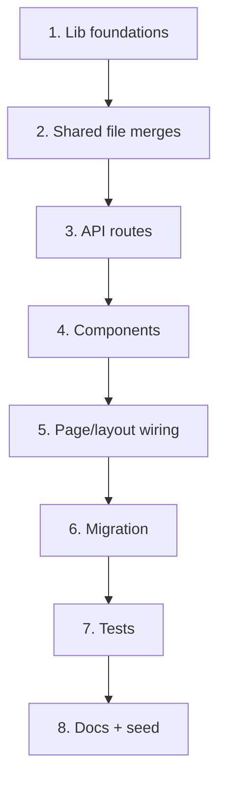

# Repository Sync Report — Catalyst-CRM-Fresh → Catalyst-crm

**Generated:** July 7, 2026  
**Source (reference):** `C:\Users\larry.nicholas\OneDrive - Oakwood University\Desktop\Catalyst-CRM-Fresh`  
**Target (this repo):** `C:\Dev\Catalyst-crm`

---

## Executive summary

Catalyst-CRM-Fresh is **one committed git revision behind** this repository but contains **54 files and substantial uncommitted work** that do not exist here. That work implements **Phase 2 pilot polish**: global search, dashboard filters and metrics, CSV import/export, form UX improvements, follow-up queue, and supporting tests and documentation.

| Category | In Fresh only | Identical | Modified in both |
| --- | ---: | ---: | ---: |
| Tracked + untracked files (excl. `node_modules`, `.next`, `.git`) | **54** | 97 | **19** |
| `package.json` | — | **Identical** | — |
| `package-lock.json` | — | **Identical** (SHA256 match) | — |
| npm scripts | — | **Identical** | — |

**Critical finding:** Copying only the 51 missing application files **without** also porting the 19 modified shared files will produce a **broken build** — new modules import symbols and behaviors added in Fresh’s modified `lib/supabase.ts`, `lib/authz.ts`, `lib/validation.ts`, `app/page.tsx`, `app/layout.tsx`, and related files.

**Do not copy:** `.env.local`, `.env.e2e.local`, `test-results/.last-run.json` (secrets or ephemeral artifacts).

---

## Git comparison

| Repository | HEAD | Branch state |
| --- | --- | --- |
| **Catalyst-crm (this)** | `3a0c652` — *docs: add production launch blocker checklist* | Clean tracked tree; `next-env.d.ts` modified locally |
| **Catalyst-CRM-Fresh** | `bb30c20` — *docs: add production readiness audit* | **18 modified** tracked files + **~50 untracked** new files (uncommitted pilot polish) |

### Commits in this repo not in Fresh

| Commit | Message |
| --- | --- |
| `3a0c652` | docs: add production launch blocker checklist |

Fresh has `docs/production-launch-blocker-checklist.md` as an **untracked** file (likely copied manually); content may differ from the committed version here.

### Commits in Fresh not in this repo

**None** — Fresh’s committed history is a strict ancestor of this repo’s HEAD.

### Fresh uncommitted work (not in either repo’s git history)

All Phase 2 pilot features below exist only as **working-tree changes** in Fresh. They were never committed to either repository.

---

## package.json, package-lock.json, and scripts

| Item | Status | Notes |
| --- | --- | --- |
| `package.json` | **Identical** | Same name, version, dependencies, devDependencies |
| `package-lock.json` | **Identical** | Hash `8E530DE1…B73016` on both sides |
| npm scripts | **Identical** | `dev`, `build`, `start`, `lint`, `test`, `test:e2e` — no new scripts in Fresh |

No package or script changes are required to sync Fresh’s application code.

---

## Files in Fresh but not here (54)

Legend: **Should copy?** — recommendation for bringing Fresh work into this repo.

### Environment and artifacts — do not copy

| File | Reason | Should copy? | Risk | Recommended action |
| --- | --- | --- | --- | --- |
| `.env.local` | Local Supabase/Vercel secrets and runtime config | **No** | **High** — credential leak, wrong project binding | Keep local-only; ensure `.env.local` is gitignored; copy variable *names* from `.env.example` only |
| `.env.e2e.local` | Playwright E2E credentials for staging | **No** | **High** — exposes test account passwords | Create locally from team runbook; never commit |
| `test-results/.last-run.json` | Playwright last-run metadata | **No** | **Low** — stale CI artifact | Ignore; regenerate by running `npm run test:e2e` |

---

### Database migration

| File | Reason | Should copy? | Risk | Recommended action |
| --- | --- | --- | --- | --- |
| `supabase/migrations/20260706203000_add_search_indexes.sql` | Adds `pg_trgm` extension and GIN indexes on `schools` and `contacts` for global search performance | **Yes** | **Medium** — migration must run on Supabase before search is usable at scale; `pg_trgm` must be allowed on the project | Copy migration; apply via `supabase db push` or dashboard SQL; verify indexes on staging before production |

---

### Seed data

| File | Reason | Should copy? | Risk | Recommended action |
| --- | --- | --- | --- | --- |
| `seed/schools-template.csv` | Sample CSV template for school import pilot (HBCU / CAE prospect list) | **Yes** | **Low** — sample data only; no secrets | Copy to `seed/`; document in onboarding checklist; do not auto-import to production |

---

### Documentation (3 files)

| File | Reason | Should copy? | Risk | Recommended action |
| --- | --- | --- | --- | --- |
| `docs/dashboard-ux-review.md` | July 6 UX review; baseline and top-10 dashboard improvements (many since implemented in Fresh) | **Yes** | **Low** | Copy for product/QA traceability |
| `docs/internal-pilot-polish.md` | Comprehensive pilot QA review (critical/high/medium/low issues) referencing Fresh-only components | **Yes** | **Low** — some findings assume Fresh code is deployed | Copy; reconcile open issues after sync |
| `docs/phase-3-agentic-architecture.md` | Phase 3 design doc (async agents, review queue, human approval gate) | **Yes** | **Low** — design only, no code | Copy for roadmap planning |

---

### API routes (3 files)

| File | Reason | Should copy? | Risk | Recommended action |
| --- | --- | --- | --- | --- |
| `app/api/search/route.ts` | `GET /api/search?q=` — authenticated global search over schools and contacts | **Yes** | **Medium** — depends on `lib/globalSearch.ts`, migration indexes, and modified `lib/supabase.ts` | Copy with search lib + migration + shared file updates |
| `app/api/export/schools/route.ts` | `GET /api/export/schools` — filtered CSV export of schools | **Yes** | **Medium** — data export surface; must enforce `requireExportAccess` | Copy with export libs; verify role gating in QA |
| `app/api/export/contacts/route.ts` | `GET /api/export/contacts` — filtered CSV export of contacts | **Yes** | **Medium** — PII export; same auth concerns as schools export | Copy with export libs; audit export access for `read_only` role |

---

### App components (8 files)

| File | Reason | Should copy? | Risk | Recommended action |
| --- | --- | --- | --- | --- |
| `app/components/GlobalSearch.tsx` | Header search combobox (debounced fetch to `/api/search`) | **Yes** | **Low** — UI only; needs `app/layout.tsx` wiring | Copy; mount in layout per Fresh |
| `app/components/DashboardTables.tsx` | Refactored dashboard tables with filters, metrics cards, import/export affordances | **Yes** | **High** — large surface; depends on many new libs and `app/page.tsx` refactor | Copy as part of dashboard bundle |
| `app/components/SchoolImport.tsx` | CSV upload UI for bulk school import with preview | **Yes** | **Medium** — bulk write path; duplicate detection | Copy with `lib/schoolImport.ts` and action |
| `app/components/UpcomingFollowUps.tsx` | Cross-account follow-up queue panel | **Yes** | **Low** | Copy with `lib/upcomingFollowUps.ts` |
| `app/components/FormSubmitButton.tsx` | Shared submit button with pending/disabled state | **Yes** | **Low** | Copy with `lib/formSubmitState.ts` |
| `app/components/ConfirmDialog.tsx` | Confirmation modal for destructive actions | **Yes** | **Low** | Copy with `lib/destructiveActionConfirm.ts` |
| `app/components/DiscoveryInterviewReadOnlyPanel.tsx` | Read-only interview display for `read_only` users | **Yes** | **Low** — addresses pilot security UX gap (C2 in polish doc) | Copy; gate write form per `internal-pilot-polish.md` |

---

### Library — search (2 files)

| File | Reason | Should copy? | Risk | Recommended action |
| --- | --- | --- | --- | --- |
| `lib/globalSearch.ts` | Search query normalization, Supabase ILIKE/trgm queries, result types | **Yes** | **Medium** — requires DB indexes migration | Copy with migration and API route |
| `lib/globalSearchSample.ts` | Fallback sample results when Supabase is unavailable (dev/demo) | **Yes** | **Low** | Copy for local dev parity |

---

### Library — CSV export (4 files)

| File | Reason | Should copy? | Risk | Recommended action |
| --- | --- | --- | --- | --- |
| `lib/csvExport.ts` | CSV serialization and filename helpers | **Yes** | **Low** | Copy with export routes |
| `lib/exportAccess.ts` | Auth + role check wrapper for export endpoints | **Yes** | **Medium** — security boundary | Copy; add tests; verify `read_only` denied |
| `lib/exportData.ts` | Supabase queries for export with dashboard filters | **Yes** | **Medium** — must respect org isolation | Copy with `lib/dashboardFilters.ts` |
| `lib/exportSample.ts` | Sample export data for offline dev | **Yes** | **Low** | Copy |

---

### Library — school import (2 files)

| File | Reason | Should copy? | Risk | Recommended action |
| --- | --- | --- | --- | --- |
| `lib/schoolImport.ts` | CSV parsing, validation, duplicate detection, preview summary | **Yes** | **Medium** — bulk insert risk | Copy with action and component |
| `lib/actions/schoolImport.ts` | Server action to commit validated import rows | **Yes** | **Medium** — must audit org scoping and rate limits | Copy; run `tests/schoolImport/*` |

---

### Library — dashboard (2 files)

| File | Reason | Should copy? | Risk | Recommended action |
| --- | --- | --- | --- | --- |
| `lib/dashboardFilters.ts` | URL/search-param parsing for status, owner, pipeline filters | **Yes** | **Low** | Copy with dashboard refactor |
| `lib/dashboardMetrics.ts` | Nine metric card calculations for dashboard | **Yes** | **Low** | Copy with `DashboardTables` |

---

### Library — follow-ups and outreach (2 files)

| File | Reason | Should copy? | Risk | Recommended action |
| --- | --- | --- | --- | --- |
| `lib/upcomingFollowUps.ts` | Sort/filter open follow-ups across schools for queue UI | **Yes** | **Low** | Copy with component |
| `lib/outreachHistory.ts` | Outreach history formatting helpers (message field support) | **Yes** | **Low** — addresses C1 in polish doc | Copy; ensure `OutreachLogForm` writes `message` |

---

### Library — form UX and cache (5 files)

| File | Reason | Should copy? | Risk | Recommended action |
| --- | --- | --- | --- | --- |
| `lib/formSubmitState.ts` | `useFormStatus`-compatible submit state helper | **Yes** | **Low** | Copy with `FormSubmitButton` |
| `lib/useFormResetKey.ts` | Hook to reset forms after successful mutation | **Yes** | **Low** | Copy; used by updated form components |
| `lib/destructiveActionConfirm.ts` | Client-side confirm flow for deletes | **Yes** | **Low** | Copy with `ConfirmDialog` |
| `lib/formActionValidation.ts` | Shared server-action validation helpers | **Yes** | **Low** | Copy with validation tests |
| `lib/revalidateSchoolViews.ts` | `revalidatePath` helpers after school mutations | **Yes** | **Low** — fixes stale UI after saves | Copy; wire into actions |

---

### Tests (19 files)

| File | Reason | Should copy? | Risk | Recommended action |
| --- | --- | --- | --- | --- |
| `tests/search/route.test.ts` | API route auth and response shape | **Yes** | **Low** | Copy with search feature |
| `tests/search/query.test.ts` | Query normalization edge cases | **Yes** | **Low** | Copy |
| `tests/search/globalSearch.test.ts` | Search logic unit tests | **Yes** | **Low** | Copy |
| `tests/export/routes.test.ts` | Export route auth and CSV headers | **Yes** | **Low** | Copy |
| `tests/csvExport/export.test.ts` | CSV serialization tests | **Yes** | **Low** | Copy |
| `tests/schoolImport/csv.test.ts` | CSV parser and validation | **Yes** | **Low** | Copy |
| `tests/schoolImport/action.test.ts` | Import server action tests | **Yes** | **Low** | Copy |
| `tests/dashboardFilters/filters.test.ts` | Filter parsing tests | **Yes** | **Low** | Copy |
| `tests/dashboardMetrics/metrics.test.ts` | Metrics calculation tests | **Yes** | **Low** | Copy |
| `tests/upcomingFollowUps/sort.test.ts` | Follow-up queue sort order | **Yes** | **Low** | Copy |
| `tests/formSubmitState.test.ts` | Form submit state helper | **Yes** | **Low** | Copy |
| `tests/formResetKey.test.ts` | Form reset hook behavior | **Yes** | **Low** | Copy |
| `tests/destructiveActionConfirm.test.ts` | Confirm dialog logic | **Yes** | **Low** | Copy |
| `tests/revalidateSchoolViews.test.ts` | Revalidation path helpers | **Yes** | **Low** | Copy |
| `tests/validation/formActionValidation.test.ts` | Form action validation | **Yes** | **Low** | Copy |
| `tests/outreach/action.test.ts` | Outreach action tests (message field) | **Yes** | **Low** | Copy |
| `tests/outreach/history.test.ts` | Outreach history display | **Yes** | **Low** | Copy |
| `tests/interviews/action.test.ts` | Interview action permission tests | **Yes** | **Low** | Copy |
| `tests/authz/canManageSchools.test.ts` | Role gating for school mutations | **Yes** | **Low** | Copy |

---

## Modified shared files (exist in both repos, different content)

These files are **not** “missing” but Fresh’s versions contain changes required for the new features above. Syncing only new files leaves the app non-functional or regressed.

| File | Fresh changes (summary) | Should copy Fresh version? | Risk | Recommended action |
| --- | --- | --- | --- | --- |
| `app/page.tsx` | Major refactor: delegates to `DashboardTables`, filters, metrics, slimmer page shell | **Yes** | **High** — core dashboard | Merge Fresh version after copying new components |
| `app/layout.tsx` | Mounts `GlobalSearch` in header | **Yes** | **Low** | Merge Fresh version |
| `app/schools/[id]/page.tsx` | Minor updates (outreach history, read-only panels) | **Yes** | **Low** | Merge Fresh version |
| `app/components/ContactForm.tsx` | Form reset, submit button, confirm patterns | **Yes** | **Medium** | Merge Fresh version |
| `app/components/DiscoveryInterviewForm.tsx` | Form UX + validation alignment | **Yes** | **Medium** | Merge; add read_only gating per polish doc |
| `app/components/FollowUpPanel.tsx` | Form reset and submit state | **Yes** | **Low** | Merge Fresh version |
| `app/components/OutreachLogForm.tsx` | Adds message/notes field (fixes C1) | **Yes** | **Medium** — data model alignment | Merge Fresh version |
| `app/components/SchoolForm.tsx` | Form reset and submit state | **Yes** | **Low** | Merge Fresh version |
| `app/settings/members/MembersSettingsPanel.tsx` | Destructive confirm, expanded admin UX | **Yes** | **Medium** | Merge Fresh version |
| `lib/supabase.ts` | Dashboard data helpers refactored for filters/search sample paths | **Yes** | **High** — many imports depend on this | Merge Fresh version |
| `lib/authz.ts` | Additional helpers (`canManageSchools`, export gates) | **Yes** | **Medium** — security | Merge Fresh version |
| `lib/validation.ts` | Outreach message schema, import validation extensions | **Yes** | **Medium** | Merge Fresh version |
| `lib/auditLog.ts` | Additional audit event type | **Yes** | **Low** | Merge Fresh version |
| `lib/actions/contacts.ts` | Revalidation after mutations | **Yes** | **Low** | Merge Fresh version |
| `lib/actions/followUps.ts` | Revalidation after mutations | **Yes** | **Low** | Merge Fresh version |
| `lib/actions/outreach.ts` | Persists `message` field | **Yes** | **Medium** | Merge Fresh version |
| `lib/actions/schools.ts` | Revalidation after mutations | **Yes** | **Low** | Merge Fresh version |
| `tests/validation/schemas.test.ts` | Tests for extended schemas | **Yes** | **Low** | Merge Fresh version |
| `docs/production-launch-blocker-checklist.md` | Fresh has untracked copy; this repo has committed `3a0c652` version | **No** (prefer this repo) | **Low** | Keep this repo’s committed version unless Fresh copy has newer edits |
| `next-env.d.ts` | Next.js auto-generated types path | **No** | **Low** | Regenerate via `npm run build`; do not manually sync |

---

## Feature bundles and dependency order

Recommended sync order to minimize broken intermediate states:



| Step | Files | Validates with |
| --- | --- | --- |
| 1 | `lib/dashboardFilters.ts`, `lib/dashboardMetrics.ts`, `lib/formSubmitState.ts`, `lib/useFormResetKey.ts`, `lib/destructiveActionConfirm.ts`, `lib/formActionValidation.ts`, `lib/revalidateSchoolViews.ts`, `lib/globalSearch.ts`, `lib/globalSearchSample.ts`, `lib/csvExport.ts`, `lib/exportAccess.ts`, `lib/exportData.ts`, `lib/exportSample.ts`, `lib/schoolImport.ts`, `lib/upcomingFollowUps.ts`, `lib/outreachHistory.ts` | `npm run test` (partial) |
| 2 | Modified shared files table above | `npm run build` |
| 3 | `lib/actions/schoolImport.ts` + `app/api/search/*` + `app/api/export/*` | `tests/search/*`, `tests/export/*` |
| 4 | All new `app/components/*` | Visual QA |
| 5 | `app/page.tsx`, `app/layout.tsx`, `app/schools/[id]/page.tsx` | Dashboard smoke test |
| 6 | `supabase/migrations/20260706203000_add_search_indexes.sql` | Staging DB + search perf |
| 7 | All new `tests/*` | `npm run test` |
| 8 | `docs/*.md`, `seed/schools-template.csv` | Documentation review |

---

## Configuration and CI

| Item | In Fresh only? | Notes |
| --- | --- | --- |
| `.github/workflows/ci.yml` | No | Identical path exists in both repos |
| `playwright.config.ts` | No | Identical |
| `vitest.config.ts` | No | Identical |
| `next.config.ts` | No | Identical |
| `middleware.ts` | No | Identical (content not diffed; assume same at `bb30c20`) |
| `eslint.config.mjs` | No | Identical |
| `tsconfig.json` | No | Identical |

No Fresh-only configuration files were found beyond local env files.

---

## Risk summary

| Risk level | Count | Primary concerns |
| --- | ---: | --- |
| **High** | 4 | Incomplete sync without shared file merges; dashboard refactor; `lib/supabase.ts` changes; env secret copy |
| **Medium** | 14 | DB migration, export PII surface, bulk import, search API, role gating, outreach message schema |
| **Low** | 36+ | Tests, docs, form UX helpers, sample data |

---

## Recommended next steps

1. **Commit or archive Fresh work** — Fresh’s pilot polish is entirely uncommitted; consider committing on a `phase-2-pilot-polish` branch in Fresh before copying.
2. **Sync in one PR** — Copy all 51 application files + merge 18 shared files (exclude `next-env.d.ts`, prefer this repo’s `production-launch-blocker-checklist.md`).
3. **Run migration on staging** — Apply `20260706203000_add_search_indexes.sql` before enabling global search in production.
4. **Run full test suite** — `npm run test` and `npm run test:e2e` after sync.
5. **Reconcile open QA items** — Use `docs/internal-pilot-polish.md` critical items (C1 outreach message, C2 read_only interview form) as acceptance criteria.
6. **Do not copy** `.env.local`, `.env.e2e.local`, or `test-results/`.

---

## Appendix: full file list (Fresh only)

```
.env.e2e.local                          [DO NOT COPY]
.env.local                                [DO NOT COPY]
app/api/export/contacts/route.ts          [COPY]
app/api/export/schools/route.ts           [COPY]
app/api/search/route.ts                   [COPY]
app/components/ConfirmDialog.tsx          [COPY]
app/components/DashboardTables.tsx      [COPY]
app/components/DiscoveryInterviewReadOnlyPanel.tsx [COPY]
app/components/FormSubmitButton.tsx       [COPY]
app/components/GlobalSearch.tsx           [COPY]
app/components/SchoolImport.tsx           [COPY]
app/components/UpcomingFollowUps.tsx      [COPY]
docs/dashboard-ux-review.md               [COPY]
docs/internal-pilot-polish.md             [COPY]
docs/phase-3-agentic-architecture.md      [COPY]
lib/actions/schoolImport.ts               [COPY]
lib/csvExport.ts                          [COPY]
lib/dashboardFilters.ts                   [COPY]
lib/dashboardMetrics.ts                   [COPY]
lib/destructiveActionConfirm.ts           [COPY]
lib/exportAccess.ts                       [COPY]
lib/exportData.ts                         [COPY]
lib/exportSample.ts                       [COPY]
lib/formActionValidation.ts               [COPY]
lib/formSubmitState.ts                    [COPY]
lib/globalSearch.ts                       [COPY]
lib/globalSearchSample.ts                 [COPY]
lib/outreachHistory.ts                    [COPY]
lib/revalidateSchoolViews.ts              [COPY]
lib/schoolImport.ts                       [COPY]
lib/upcomingFollowUps.ts                  [COPY]
lib/useFormResetKey.ts                    [COPY]
seed/schools-template.csv                 [COPY]
supabase/migrations/20260706203000_add_search_indexes.sql [COPY]
test-results/.last-run.json               [DO NOT COPY]
tests/authz/canManageSchools.test.ts      [COPY]
tests/csvExport/export.test.ts            [COPY]
tests/dashboardFilters/filters.test.ts    [COPY]
tests/dashboardMetrics/metrics.test.ts    [COPY]
tests/destructiveActionConfirm.test.ts    [COPY]
tests/export/routes.test.ts               [COPY]
tests/formResetKey.test.ts                [COPY]
tests/formSubmitState.test.ts             [COPY]
tests/interviews/action.test.ts           [COPY]
tests/outreach/action.test.ts             [COPY]
tests/outreach/history.test.ts            [COPY]
tests/revalidateSchoolViews.test.ts       [COPY]
tests/schoolImport/action.test.ts         [COPY]
tests/schoolImport/csv.test.ts            [COPY]
tests/search/globalSearch.test.ts         [COPY]
tests/search/query.test.ts                [COPY]
tests/search/route.test.ts                [COPY]
tests/upcomingFollowUps/sort.test.ts      [COPY]
tests/validation/formActionValidation.test.ts [COPY]
```
